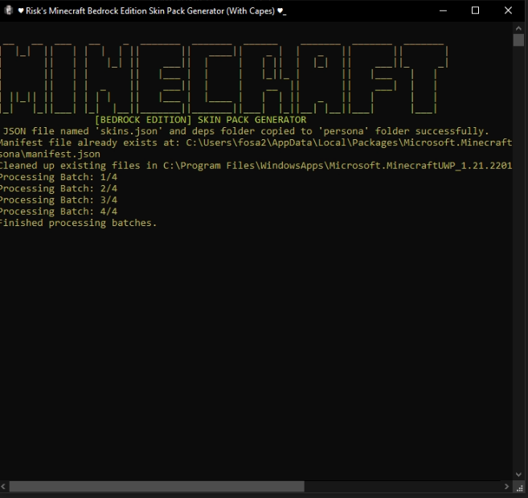

# Minecraft Bedrock Edition Skinpack Compiler

Tired of manually using IObit unlocker manually everytime you want to put custom skins with capes? or even installing the bypass

Download from releases on the right! ➨

here is the answer 😎, this requires nothing other than to get your cape and skin textures, apply them to the correct folders and run the program. 
everything else is automated

**this even works from a fresh minecraft for windows installation**

