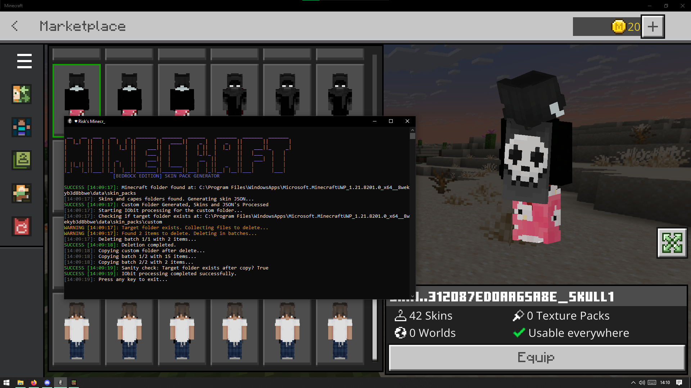

# Minecraft Bedrock Edition Skinpack Compiler

Tired of manually using IObit unlocker manually everytime you want to put custom skins with capes? or even installing the bypass

here is the answer 😎, this requires nothing other than to get your cape and skin textures, apply them to the correct folders and run the program. 
everything else is automated

> [!WARNING]
>  **REMOVED ZOMBIE ARMS** due to having to remake this, and minecrafts update breaking skins, not using persona/default anymore, functionality for zombie arms is removed, if another way of doing it appears, then i will try to re-add the functionality
>

> [!IMPORTANT]
> Get From releases or this link [Download](https://github.com/Leetrisk/MinecraftBedrockEdition-Skinpack-Compiler/releases/download/Release/MinecraftBedrockEdition-Skinpack-Compiler.rar.rar) !
>

**this even works from a fresh minecraft for windows installation, if the tool breaks and the in-game skin pack is stuck as default skins, just reinstall your bedrock installation,  the tool should work again after**

