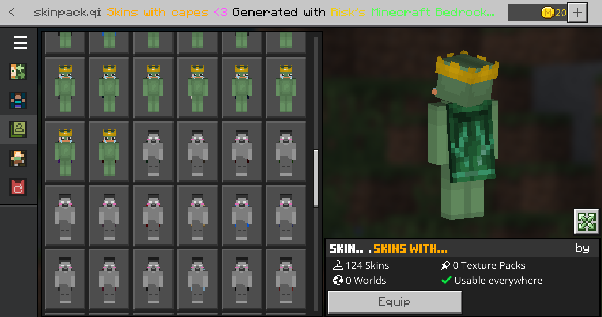

# Minecraft Bedrock Edition Skinpack Compiler

Tired of manually using IObit unlocker manually everytime you want to put custom skins with capes? or even installing the bypass

here is the answer 😎, this requires nothing other than to get your cape and skin textures, apply them to the correct folders and run the program. 
everything else is automated

- **ADDED ZOMBIE ARMS** (note this is limited to 1 slim and 1 normal skin since it uses the defaults as a base, no way around this, otherwise servers like hive will set you to a random default skin

> [!IMPORTANT]
> Get From releases or this link [Download](https://github.com/Leetrisk/MinecraftBedrockEdition-Skinpack-Compiler/releases/download/Release/MinecraftBedrockEdition-Skinpack-Compiler.rar) !
>

**this even works from a fresh minecraft for windows installation**

  

